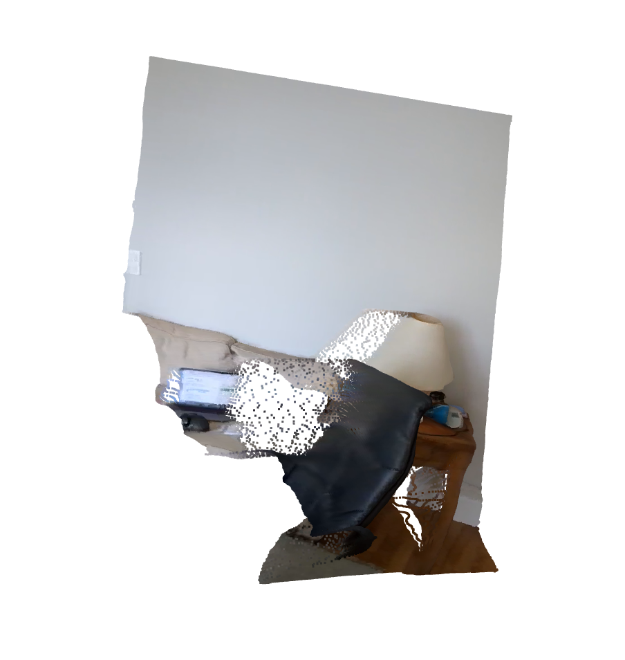

# 3DFromMonocularDepth

Once the inference is done with [Depth-Anything-V2](https://github.com/DepthAnything/Depth-Anything-V2), it saved for each image a corresponding PLY (XYZ+RGB). For this, you had to give the intrinsics camera parameters.

You can then visualize the results with :

```
python3 viz.py path/to/the/plys/
```

This will open up an Open3D basic visualizer:

<p>
<em>Open3D viz</em></br>

</p>

Then use `SPACE` to start/pause/resume frames and press `N` to go to next frame.